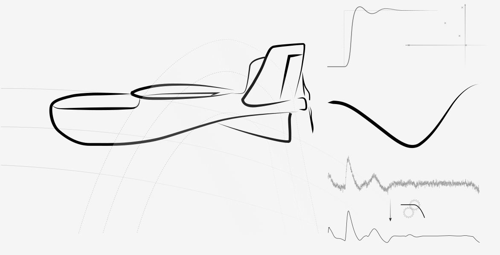

# Applied Flight Mechanics and Flight Control


GitHub repository for exchanging source code of the project.

## Setup

You can clone the repository to get the source code by using the `clone` command in terminal.
```
git clone https://github.com/hnamtang/aff-ss23.git
```
